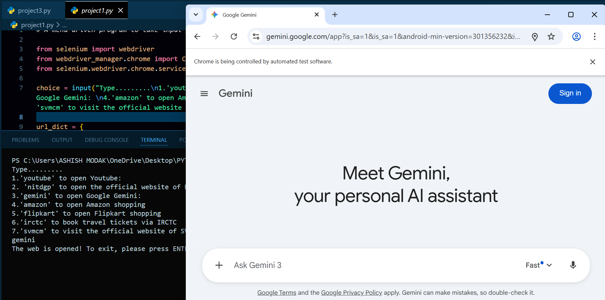
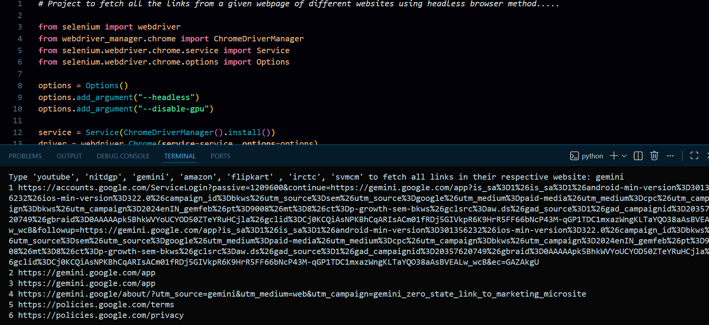

# Python Selenium Automation Projects

This repository contains a series of **Python + Selenium automation projects**
that demonstrate progressive learning — from basic browser automation to
advanced workflow automation.

All projects use **Selenium WebDriver** as the core automation library.

---

## 📌 Projects Overview

### 🔹 Project 1: Automated Website Launcher
- Takes predefined website names as user input
- Automatically opens the selected website using Selenium
- 

### 🔹 Project 2: Website Link Fetcher
- Opens a predefined website
- Fetches all hyperlinks (`<a>` tags) from the website
- 

### 🔹 Project 3: Link Fetcher & WhatsApp Automation
- Fetches all website links using Selenium
- Sends extracted links via WhatsApp using `pywhatkit`

---

## 🛠️ Common Tech Stack
- Python
- Selenium
- webdriver-manager
- Google Chrome
- Pywhatkit

---

## Important pre-cautions ..........
- The web version of Whatsapp should be logged to your default browser to execute project no. 3
- Do not close the browser during execution
- Stable internet connection required

---

## 🎯 Purpose of This Repository
- Practice Selenium automation
- Understand browser interaction
- Learn web scraping fundamentals
- Build real-world automation workflows

---

## ▶️ How to Run
```bash
pip install selenium webdriver-manager
python main.py

```

## 👤 Author
**Ashish Modak**  
Python & Automation Learner
